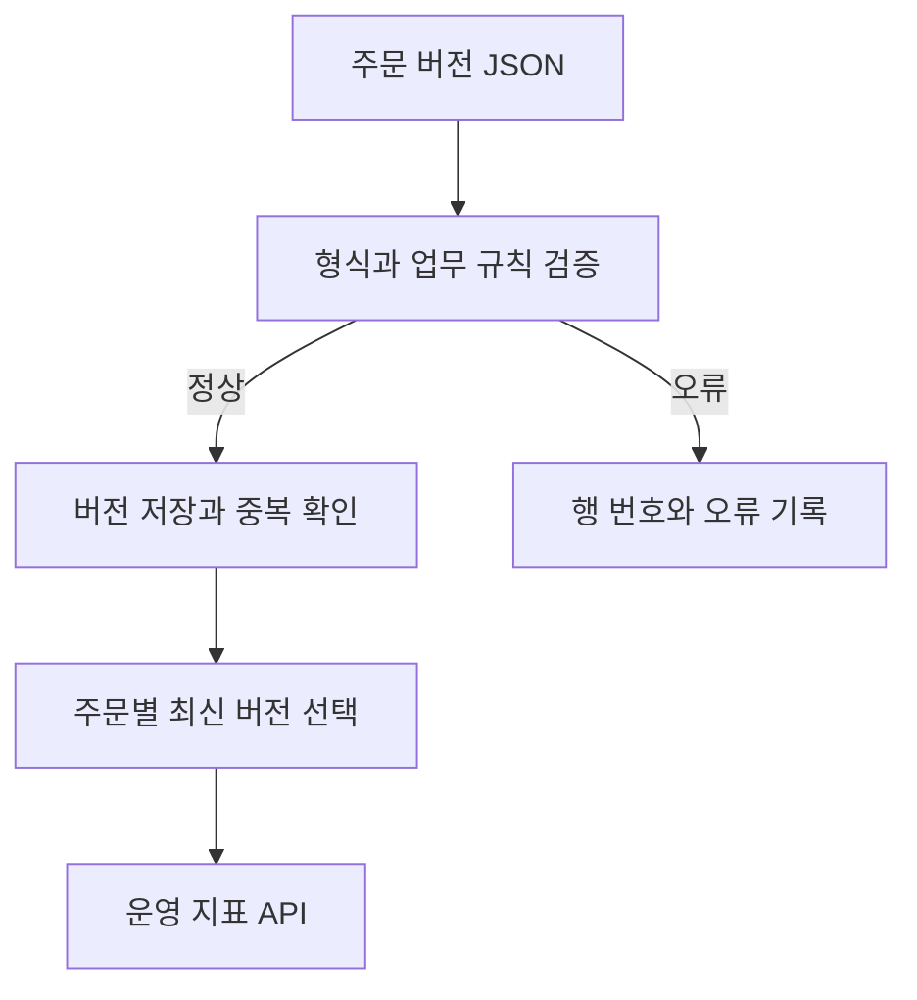

# 실행 및 코드 안내

## 1. 빠른 실행

저장소의 projects/orderlens 폴더에서 실행합니다. 처음 설치할 때는 패키지 다운로드를 위한 인터넷 연결이 필요합니다. 데모 실행에는 유료 API나 외부 계정이 필요하지 않습니다.

### Linux / macOS

```bash
python3 -m venv .venv
source .venv/bin/activate
python -m pip install -r requirements.lock
python -m scripts.check
```

### Windows PowerShell

```powershell
py -3.12 -m venv .venv
.\.venv\Scripts\python.exe -m pip install -r requirements.lock
.\.venv\Scripts\python.exe -m scripts.check
```

마지막 명령은 코드 검사, 핵심 테스트, 예제 데이터 생성, API 데모, 문서 검색 평가, 실제 HTTP 시연을 순서대로 실행합니다. 기존 주문 DB를 덮어쓰지 않고 임시 DB를 사용하며 시연 서버는 자동 종료됩니다.

| 산출물 | 내용 |
|---|---|
| artifacts/demo_report.json | 적재 결과, 재전송 결과, 주문 지표, 근거 문서 |
| artifacts/retrieval_evaluation.json | 작은 예제 집합에 대한 검색 평가 |
| artifacts/http_smoke.json | 실제 HTTP 요청과 인증 검사 결과 |
| data/demo_batch.json | 중복·오류가 섞인 재현 가능한 합성 주문 309행 |

데모의 기준 시각은 **2026-09-08 00:00 UTC**로 고정됩니다. 처음 적재하면 정상 버전 300개, 중복 5개, 오류 4개가 나옵니다. 최신 주문은 120건이며, 배송 지연 미완료 주문은 40건입니다. 재전송 때 새로 저장되는 주문 버전은 0개입니다. 이 수치는 실제 사업 성과가 아닌 합성 데이터 검증 결과입니다.

## 2. API 서버 실행

```bash
python -m uvicorn orderlens.main:app --host 127.0.0.1 --port 8000
```

Windows에서는 앞의 python을 .\.venv\Scripts\python.exe로 바꾸셔도 됩니다.

브라우저에서 [API 문서](http://127.0.0.1:8000/docs)를 열고 Authorize에 로컬 데모 키인 `orderlens-local-demo-key`를 입력합니다. Swagger 문서 화면은 CDN 연결이 필요할 수 있습니다. 아래 HTTP 요청은 문서 화면 없이도 실행됩니다.

```bash
curl -X POST http://127.0.0.1:8000/v1/ingestions \
  -H 'Content-Type: application/json' \
  -H 'X-API-Key: orderlens-local-demo-key' \
  --data-binary @data/demo_batch.json

curl 'http://127.0.0.1:8000/v1/metrics?as_of=2026-09-08T00%3A00%3A00Z' \
  -H 'X-API-Key: orderlens-local-demo-key'

curl -X POST http://127.0.0.1:8000/v1/knowledge/search \
  -H 'Content-Type: application/json' \
  -H 'X-API-Key: orderlens-local-demo-key' \
  -d '{"query":"중복 적재 버전 충돌","top_k":3}'
```

서버에서 저장한 내용은 현재 폴더의 orderlens.db에 남습니다. `scripts.demo`가 사용하는 임시 DB와 별개입니다. 로컬 키는 예제에 공개되어 있으므로 외부 공개 전에 환경 변수 ORDERLENS_API_KEY를 고유한 키로 설정해야 합니다.

## 3. 구현된 API

| API | 역할 |
|---|---|
| GET /health | DB 연결 상태 확인 |
| POST /v1/ingestions | 최대 500행을 검증하고 정상 행만 적재 |
| GET /v1/runs/{run_id} | 한 번의 적재 결과와 오류 행 위치 조회 |
| GET /v1/quality | 적재 시도 기준 오류·중복 통계 |
| GET /v1/metrics | 최신 버전 기반 전체·판매 경로별 주문 지표 |
| GET /v1/orders | 판매 경로·상태별 최신 주문 목록과 페이지 조회 |
| GET /v1/orders/attention | 배송 예정 시각이 지난 미완료 주문 조회 |
| POST /v1/knowledge/search | 업무 문서 검색 및 문서 ID·버전·근거 반환 |
| GET /v1/brief | 운영 지표와 관련 문서를 연결한 규칙 기반 요약 |

health와 API 문서를 제외한 /v1 API는 X-API-Key를 확인합니다. 고객에게 연락하거나 주문을 변경하는 동작은 구현하지 않았습니다.

### 주문 목록의 다음 페이지

```bash
curl 'http://127.0.0.1:8000/v1/orders?source=market_a&status=paid&limit=2&offset=0&as_of=2026-09-08T00%3A00%3A00Z' \
  -H 'X-API-Key: orderlens-local-demo-key'

# 예제 데이터의 첫 응답은 next_offset=2입니다. 필터와 기준 시각은 유지합니다.
curl 'http://127.0.0.1:8000/v1/orders?source=market_a&status=paid&limit=2&offset=2&as_of=2026-09-08T00%3A00%3A00Z' \
  -H 'X-API-Key: orderlens-local-demo-key'
```

`source`는 `market_a`, `market_b`, `own_store`, `status`는 `paid`, `shipped`, `delivered`, `cancelled`, `refunded` 중 하나입니다. 생략한 필터는 전체 대상을 포함합니다. 주문 시각 내림차순으로 읽고, 시각이 같으면 판매 경로와 주문 번호 오름차순입니다.

`limit`은 기본 20, 최대 100이며 `offset`은 기본 0입니다. 마지막 페이지의 `has_more`는 false, `next_offset`은 null입니다. 빈 목록도 정상 응답입니다. `as_of`를 생략하면 응답에 첫 요청의 기준 시각을 돌려주므로 다음 요청부터 그 값을 넣습니다.

페이지 사이에 과거 자료를 새로 적재하면 같은 `as_of`에서도 중복·누락이 생길 수 있습니다. 재현 조건과 선택 이유는 [페이지 조회 설계](decisions/order_pagination.md)를 확인해 주세요.

## 4. 코드 읽는 순서

| 순서 | 파일 | 이해할 질문 |
|---|---|---|
| 1 | scripts/generate_demo.py | 주문 한 건과 주문 상태 변경은 어떻게 표현할까요? |
| 2 | orderlens/schemas.py | 왜 금액·날짜·상태를 검증할까요? |
| 3 | orderlens/main.py | URL로 온 요청이 어느 함수에 전달될까요? |
| 4 | orderlens/models.py, db.py | Python 객체가 어떤 테이블에 저장될까요? |
| 5 | orderlens/ingestion.py | 중복과 충돌은 어떻게 구분할까요? |
| 6 | orderlens/analytics.py | 같은 주문의 여러 버전 중 어느 것을 집계할까요? |
| 7 | orderlens/retrieval.py | 검색 점수와 답변의 정확성은 왜 다를까요? |
| 8 | tests/ | 어떤 입력을 넣었을 때 어떤 결과를 기대할까요? |

## 5. 데이터 흐름



## 6. PostgreSQL 실행 설정

Docker와 Docker Compose가 설치된 환경에서 다음과 같이 실행하도록 구성했습니다.

```bash
cp .env.example .env
docker compose up --build
```

Windows에서는 `Copy-Item .env.example .env`를 사용하실 수 있습니다. Compose는 PostgreSQL에 연결하고 API를 내 컴퓨터의 8000번 포트에 제공합니다. 데이터 볼륨은 컨테이너를 내려도 유지됩니다.

**로컬에서는 SQLite로 검증했습니다. Docker 이미지 실행과 PostgreSQL 실서버 통합은 아직 검증하지 않았습니다.** 로컬·원격 실행 근거와 검증 범위는 [검증 기록](validation.md)을 확인해 주세요.

## 7. 다음 문서

- [설계와 지표 정의](design.md)
- [1년 학습 계획](roadmap.md)
- [첫 2주 학습 안내](first_two_weeks.md)
- [채용 공고 비교와 프로젝트 선택 근거](market_review.md)
- [자동화 범위와 다음 기능](automation_and_backlog.md)

처음에는 모든 파일을 한 번에 이해하려 하지 않으셔도 됩니다. 주문 한 건을 만들고, API로 보내고, 저장된 결과가 어떻게 집계되는지부터 따라가시면 됩니다.
